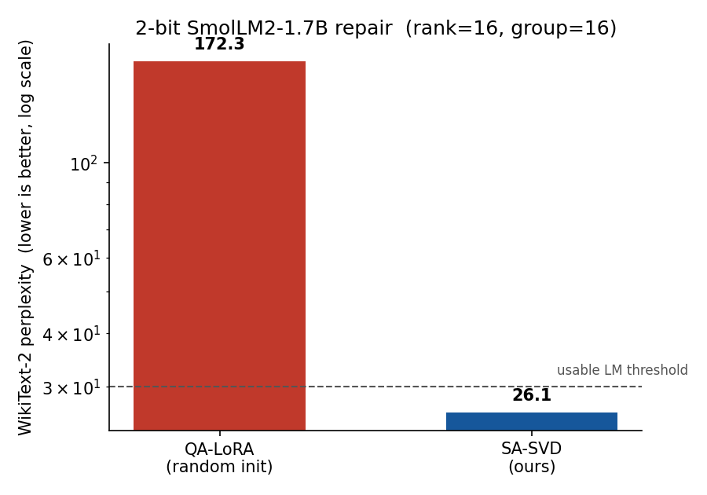

# SA-SVD: Repairing 2-bit LLMs with Structure-Aware SVD Initialization

**One sentence:** at 2-bit precision, some language models collapse and standard
QA-LoRA fine-tuning cannot bring them back. Initializing the adapter with a
**quantization-group-aware SVD of the weights** repairs them.



SmolLM2-1.7B quantized to 2-bit, then fine-tuned with QA-LoRA. With standard
random initialization the model stays broken (WikiText-2 perplexity ~172). With
SA-SVD initialization it recovers to a usable ~26, at the **same rank, group
size, and training budget**. The only thing that changed is how the adapter was
initialized.

This repository accompanies my M.Sc. thesis at TU Berlin (*Accelerating
Quantization-Aware Training of 2-bit Compact Language Models*, supervised by
Prof. W. Samek and Prof. K.-R. Müller, Fraunhofer HHI). It builds on the
official QA-LoRA implementation I contributed to Hugging Face PEFT
([#2571](https://github.com/huggingface/peft/pull/2571),
[#2664](https://github.com/huggingface/peft/pull/2664)).

---

## Quickstart

```bash
git clone https://github.com/gapsong/sa-svd-qa-lora
cd sa-svd-qa-lora
pip install -e .

# 1. Verify your setup runs the SA-SVD pipeline end to end (~5 min, CPU ok).
python scripts/demo_fast.py

# 2. Reproduce the headline SmolLM2 result (~1-2 h on a 24 GB GPU).
python scripts/reproduce.py --method both
python scripts/plot_results.py        # regenerates assets/hero.png
```

You do **not** need to run anything to see the result; the chart above is
checked in. The commands are for reproducing it yourself.

---

## The idea

QA-LoRA fine-tunes a quantized model by forcing the LoRA adapter to be constant
within each quantization group, which lets the adapter merge into the group's
zero-point with no re-quantization loss. The standard recipe initializes that
adapter **randomly**.

At 2-bit, a handful of high-magnitude outlier weights can stretch the
quantization grid so far that every other weight rounds to the same level. The
model suffers *resolution collapse*, and a random adapter has no path back.

**SA-SVD** initializes the adapter with the **principal components of the
weights**, computed so they align with the quantization groups:

1. **Pool** the weight matrix along each quantization group (average within
   groups).
2. **Decompose** the pooled matrix with SVD; keep the top-`r` singular vectors.
3. **Initialize** the adapter `B, A` from those vectors.
4. **Quantize the residual** `W - B·expand(A)` as the frozen base.

The adapter now carries the dominant structure of the original weights, so
fine-tuning starts from a healthy point instead of from noise. It is a
quantization-aware variant of [PiSSA](https://arxiv.org/abs/2404.02948).

The whole method is ~80 lines: [`src/sa_svd/core.py`](src/sa_svd/core.py).

---

## When it helps (and when it doesn't)

SA-SVD is a **repair mechanism**, most valuable for models that collapse under
2-bit quantization (high weight dynamic range, e.g. SmolLM2). For models that
already quantize cleanly (e.g. Qwen2-1.5B), standard QA-LoRA is usually enough
and SA-SVD adds little. The thesis maps this boundary in detail; understanding
*which models benefit and why* is the subject of ongoing work.

---

## How the pieces fit

| File | Role |
|------|------|
| `src/sa_svd/core.py` | The SA-SVD decomposition. The novel part. |
| `src/sa_svd/integration.py` | Apply SA-SVD to a model and write it into a PEFT adapter. |
| `scripts/demo_fast.py` | Fast environment check, no large download. |
| `scripts/reproduce.py` | Full SmolLM2 reproduction (train + eval). |
| `scripts/pipeline.py` | Thin GPTQ + QA-LoRA + train + WikiText-eval helpers. |
| `scripts/plot_results.py` | Renders the hero chart from `results/results.json`. |
| `tests/test_core.py` | Verifies the residual identity and low-rank capture. |

Run the tests with `pytest tests/`.

---

## Citation

```bibtex
@mastersthesis{tonthat2025sasvd,
  title  = {Accelerating Quantization-Aware Training of 2-bit Compact Language Models},
  author = {Ton-That, Khiem},
  school = {Technische Universit\"at Berlin},
  year   = {2025}
}
```

## License

Apache 2.0. See [LICENSE](LICENSE).
